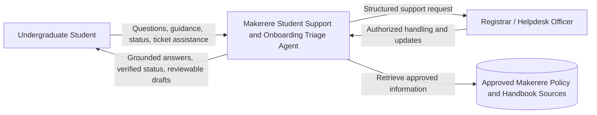

# 01. System Context

```mermaid
flowchart LR
  student[Undergraduate Student]
  agent[Makerere Student Support and Onboarding Triage Agent]
  staff[Registrar / Helpdesk Officer]
  policy[(Approved Makerere Policy and Handbook Sources)]

  student -->|Questions, guidance, status, ticket assistance| agent
  agent -->|Grounded answers, verified status, reviewable drafts| student
  agent -->|Structured support request| staff
  staff -->|Authorized handling and updates| agent
  agent -->|Retrieve approved information| policy
```

This view shows people, the system boundary, and approved external information only. Internal AI, API, database, and tool details belong in lower-level views.
