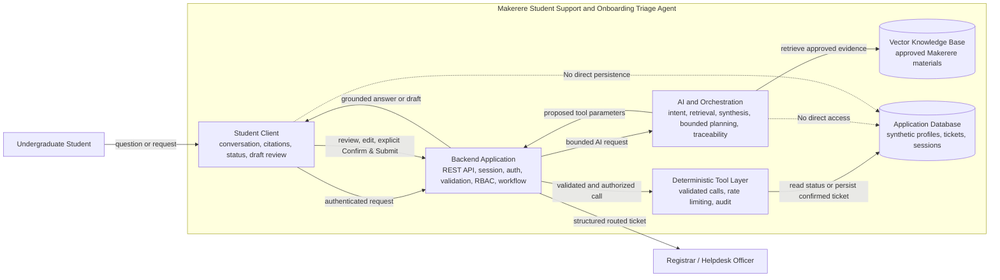

# 02. Logical Container Architecture

```mermaid
flowchart LR
  student[Undergraduate Student]
  staff[Registrar / Helpdesk Officer]
  subgraph system[Makerere Student Support and Onboarding Triage Agent]
    client[Student Client\nconversation, citations, status, draft review]
    backend[Backend Application\nREST API, session, auth, validation, RBAC, workflow]
    ai[AI and Orchestration\nintent, retrieval, synthesis, bounded planning, traceability]
    tools[Deterministic Tool Layer\nvalidated calls, rate limiting, audit]
    knowledge[(Vector Knowledge Base\napproved Makerere materials)]
    data[(Application Database\nsynthetic profiles, tickets, sessions)]
  end
  student -->|question or request| client
  client -->|authenticated request| backend
  backend -->|bounded AI request| ai
  ai -->|retrieve approved evidence| knowledge
  ai -->|proposed tool parameters| backend
  backend -->|validated and authorized call| tools
  tools -->|read status or persist confirmed ticket| data
  backend -->|grounded answer or draft| client
  client -->|review, edit, explicit Confirm & Submit| backend
  backend -->|structured routed ticket| staff
  ai -.->|No direct access| data
  client -.->|No direct persistence| data
```

Physical deployment and hosting technology are outside this systems-design view.
