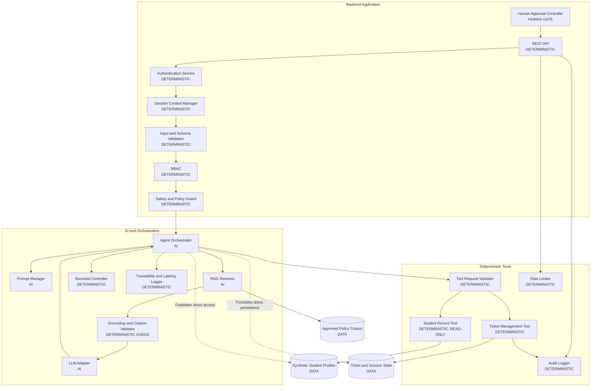

# 03. Component Architecture

```mermaid
flowchart TB
  subgraph backend[Backend Application]
    api[REST API\nDETERMINISTIC]
    auth[Authentication Service\nDETERMINISTIC]
    session[Session Context Manager\nDETERMINISTIC]
    validate[Input and Schema Validation\nDETERMINISTIC]
    rbac[RBAC\nDETERMINISTIC]
    guard[Safety and Policy Guard\nDETERMINISTIC]
    approval[Human Approval Controller\nHUMAN GATE]
  end
  subgraph orchestration[AI and Orchestration]
    orchestrator[Agent Orchestrator\nAI]
    prompt[Prompt Manager\nAI]
    llm[LLM Adapter\nAI]
    retriever[RAG Retriever\nAI]
    grounding[Grounding and Citation Validator\nDETERMINISTIC CHECK]
    bounded[Bounded Controller\nDETERMINISTIC]
    trace[Traceability and Latency Logger\nDETERMINISTIC]
  end
  subgraph tools[Deterministic Tools]
    toolvalidate[Tool Request Validator\nDETERMINISTIC]
    status[Student Record Tool\nDETERMINISTIC, READ-ONLY]
    ticket[Ticket Management Tool\nDETERMINISTIC]
    audit[Audit Logger\nDETERMINISTIC]
    rate[Rate Limiter\nDETERMINISTIC]
  end
  policy[(Approved Policy Corpus\nDATA)]
  records[(Synthetic Student Profiles\nDATA)]
  tickets[(Ticket and Session State\nDATA)]
  api --> auth --> session --> validate --> rbac --> guard --> orchestrator
  orchestrator --> prompt
  orchestrator --> bounded
  orchestrator --> retriever --> policy
  retriever --> grounding --> llm --> orchestrator
  orchestrator --> trace
  orchestrator --> toolvalidate
  toolvalidate --> status --> records
  toolvalidate --> ticket --> tickets
  approval --> api
  api --> rate
  api --> audit
  ticket --> audit
  orchestrator -.->|Forbidden direct access| records
  orchestrator -.->|Forbidden direct persistence| tickets
```

Every AI proposal passes through deterministic validation, authorization, and workflow control before tool execution.
