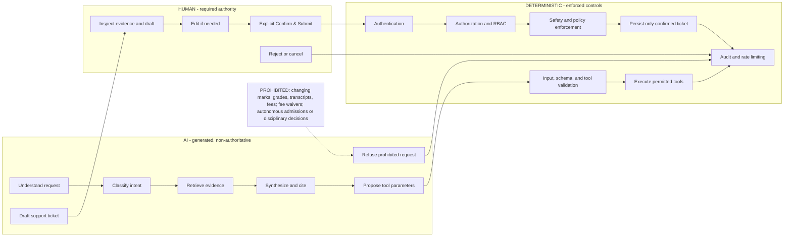

# 04. AI, Deterministic, and Human Responsibility Boundary

```mermaid
flowchart LR
  subgraph ai[AI - generated, non-authoritative]
    understand[Understand request]
    classify[Classify intent]
    retrieve[Retrieve evidence]
    synthesize[Synthesize and cite]
    parameters[Propose tool parameters]
    draft[Draft support ticket]
    refuse[Refuse prohibited request]
  end
  subgraph deterministic[DETERMINISTIC - enforced controls]
    auth[Authentication]
    authorize[Authorization and RBAC]
    validate[Input, schema, and tool validation]
    safety[Safety and policy enforcement]
    execute[Execute permitted tools]
    persist[Persist only confirmed ticket]
    audit[Audit and rate limiting]
  end
  subgraph human[HUMAN - required authority]
    inspect[Inspect evidence and draft]
    edit[Edit if needed]
    confirm[Explicit Confirm & Submit]
    reject[Reject or cancel]
  end
  understand --> classify --> retrieve --> synthesize --> parameters --> validate
  draft --> inspect --> edit --> confirm --> auth --> authorize --> safety --> persist
  validate --> execute
  reject --> audit
  refuse --> audit
  execute --> audit
  persist --> audit
  prohibited[PROHIBITED: changing marks, grades, transcripts, fees; fee waivers; autonomous admissions or disciplinary decisions]
  prohibited -.-> refuse
```

The AI never directly modifies authoritative records or persists a ticket. Student confirmation is mandatory before ticket persistence.
