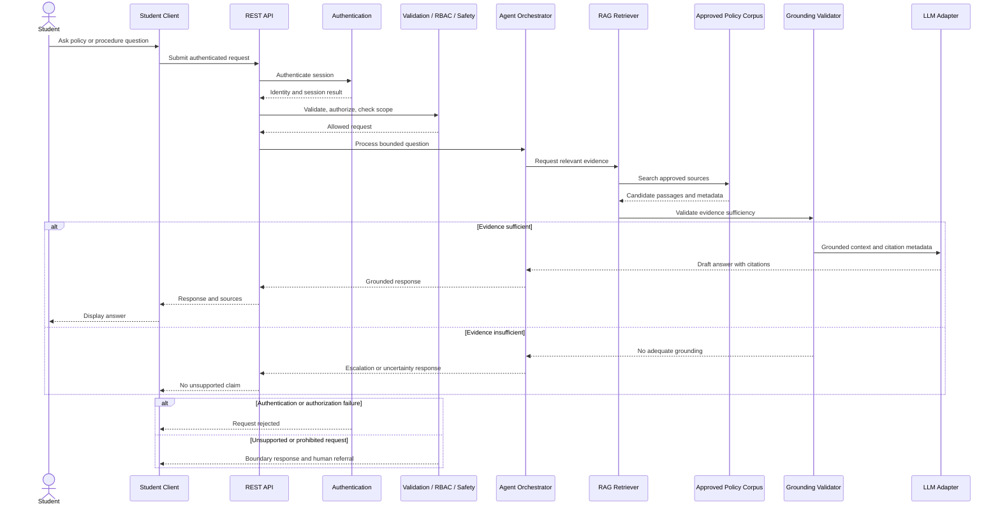

# 05. Policy Question Sequence

```mermaid
sequenceDiagram
  actor Student
  participant Client as Student Client
  participant API as REST API
  participant Auth as Authentication
  participant Guard as Validation / RBAC / Safety
  participant Agent as Agent Orchestrator
  participant Retriever as RAG Retriever
  participant Corpus as Approved Policy Corpus
  participant Ground as Grounding Validator
  participant LLM as LLM Adapter
  Student->>Client: Ask policy or procedure question
  Client->>API: Submit authenticated request
  API->>Auth: Authenticate session
  Auth-->>API: Identity and session result
  API->>Guard: Validate, authorize, check scope
  Guard-->>API: Allowed request
  API->>Agent: Process bounded question
  Agent->>Retriever: Request relevant evidence
  Retriever->>Corpus: Search approved sources
  Corpus-->>Retriever: Candidate passages and metadata
  Retriever->>Ground: Validate evidence sufficiency
  alt Evidence sufficient
    Ground->>LLM: Grounded context and citation metadata
    LLM-->>Agent: Draft answer with citations
    Agent-->>API: Grounded response
    API-->>Client: Response and sources
    Client-->>Student: Display answer
  else Evidence insufficient
    Ground-->>Agent: No adequate grounding
    Agent-->>API: Escalation or uncertainty response
    API-->>Client: No unsupported claim
  end
  alt Authentication or authorization failure
    Auth-->>Client: Request rejected
  else Unsupported or prohibited request
    Guard-->>Client: Boundary response and human referral
  end
```
