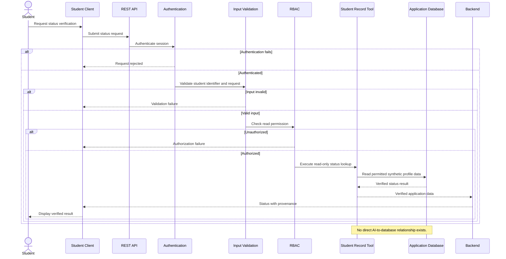

# 06. Student Status Verification Sequence

```mermaid
sequenceDiagram
  actor Student
  participant Client as Student Client
  participant API as REST API
  participant Auth as Authentication
  participant Input as Input Validation
  participant RBAC
  participant Tool as Student Record Tool
  participant DB as Application Database
  participant Backend
  Student->>Client: Request status verification
  Client->>API: Submit status request
  API->>Auth: Authenticate session
  alt Authentication fails
    Auth-->>Client: Request rejected
  else Authenticated
    Auth->>Input: Validate student identifier and request
    alt Input invalid
      Input-->>Client: Validation failure
    else Valid input
      Input->>RBAC: Check read permission
      alt Unauthorized
        RBAC-->>Client: Authorization failure
      else Authorized
        RBAC->>Tool: Execute read-only status lookup
        Tool->>DB: Read permitted synthetic profile data
        DB-->>Tool: Verified status result
        Tool-->>Backend: Verified application data
        Backend-->>Client: Status with provenance
        Client-->>Student: Display verified result
      end
    end
  end
  Note over Tool,DB: No direct AI-to-database relationship exists.
```
