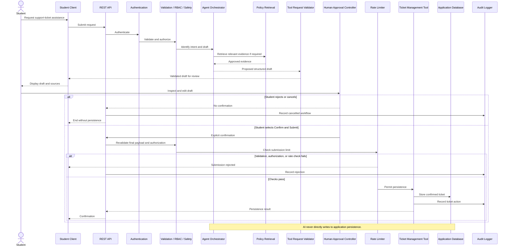

# 07. Ticket Drafting, Human Review, and Confirmed Persistence

```mermaid
sequenceDiagram
  actor Student
  participant Client as Student Client
  participant API as REST API
  participant Auth as Authentication
  participant Control as Validation / RBAC / Safety
  participant Agent as Agent Orchestrator
  participant Policy as Policy Retrieval
  participant Validator as Tool Request Validator
  participant Approval as Human Approval Controller
  participant Rate as Rate Limiter
  participant Tool as Ticket Management Tool
  participant DB as Application Database
  participant Audit as Audit Logger
  Student->>Client: Request support-ticket assistance
  Client->>API: Submit request
  API->>Auth: Authenticate
  Auth->>Control: Validate and authorize
  Control->>Agent: Identify intent and draft
  Agent->>Policy: Retrieve relevant evidence if required
  Policy-->>Agent: Approved evidence
  Agent-->>Validator: Proposed structured draft
  Validator-->>Client: Validated draft for review
  Client-->>Student: Display draft and sources
  Student->>Approval: Inspect and edit draft
  alt Student rejects or cancels
    Approval-->>API: No confirmation
    API->>Audit: Record cancelled workflow
    API-->>Client: End without persistence
  else Student selects Confirm and Submit
    Approval->>API: Explicit confirmation
    API->>Control: Revalidate final payload and authorization
    Control->>Rate: Check submission limit
    alt Validation, authorization, or rate check fails
      Rate-->>Client: Submission rejected
      API->>Audit: Record rejection
    else Checks pass
      Rate->>Tool: Permit persistence
      Tool->>DB: Store confirmed ticket
      Tool->>Audit: Record ticket action
      Tool-->>API: Persistence result
      API-->>Client: Confirmation
    end
  end
  Note over Agent,DB: AI never directly writes to application persistence.
```
