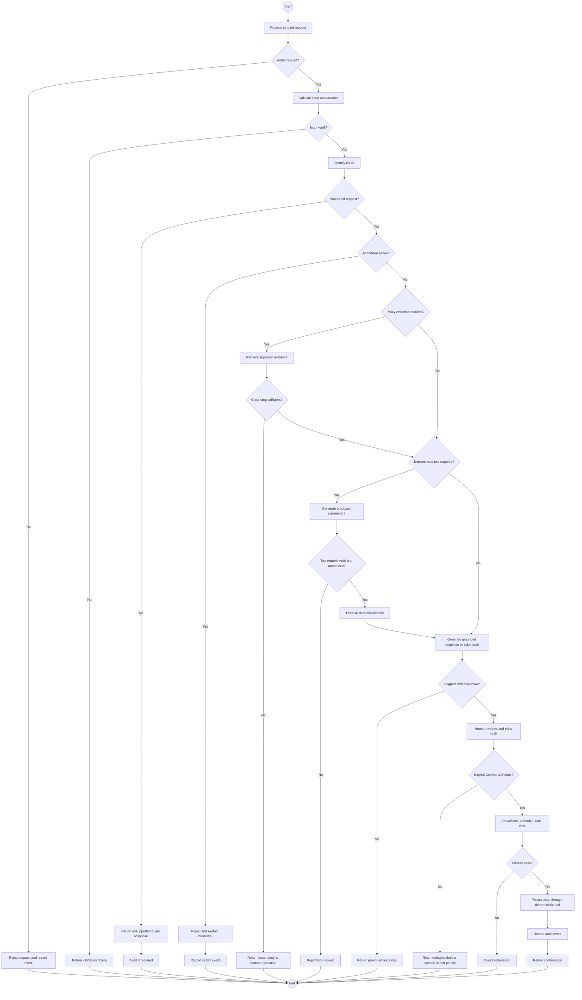

# 08. End-to-End Agent Activity

```mermaid
flowchart TD
  start((Start)) --> receive[Receive student request]
  receive --> authenticate{Authenticated?}
  authenticate -- No --> authFail[Reject request and record event] --> finish((End))
  authenticate -- Yes --> validate[Validate input and session]
  validate --> valid{Input valid?}
  valid -- No --> invalid[Return validation failure] --> finish
  valid -- Yes --> intent[Identify intent]
  intent --> supported{Supported request?}
  supported -- No --> unsupported[Return unsupported-query response] --> audit1[Audit if required] --> finish
  supported -- Yes --> prohibited{Prohibited action?}
  prohibited -- Yes --> reject[Reject and explain boundary] --> audit2[Record safety event] --> finish
  prohibited -- No --> evidence{Policy evidence required?}
  evidence -- Yes --> retrieve[Retrieve approved evidence]
  retrieve --> grounded{Grounding sufficient?}
  grounded -- No --> escalate[Return uncertainty or human escalation] --> finish
  grounded -- Yes --> toolCheck{Deterministic tool required?}
  evidence -- No --> toolCheck
  toolCheck -- Yes --> propose[Generate proposed parameters]
  propose --> toolValid{Tool request valid and authorized?}
  toolValid -- No --> toolReject[Reject tool request] --> finish
  toolValid -- Yes --> execute[Execute deterministic tool]
  execute --> output[Generate grounded response or ticket draft]
  toolCheck -- No --> output
  output --> ticket{Support-ticket workflow?}
  ticket -- No --> answer[Return grounded response] --> finish
  ticket -- Yes --> review[Human reviews and edits draft]
  review --> confirm{Explicit Confirm & Submit?}
  confirm -- No --> noPersist[Return editable draft or cancel; do not persist] --> finish
  confirm -- Yes --> finalCheck[Revalidate, authorize, rate-limit]
  finalCheck --> permitted{Checks pass?}
  permitted -- No --> submitReject[Reject submission] --> finish
  permitted -- Yes --> persist[Persist ticket through deterministic tool]
  persist --> audit3[Record audit event]
  audit3 --> confirmation[Return confirmation]
  confirmation --> finish
```

This is logical system behavior only. It does not describe hosting, deployment, or infrastructure.
