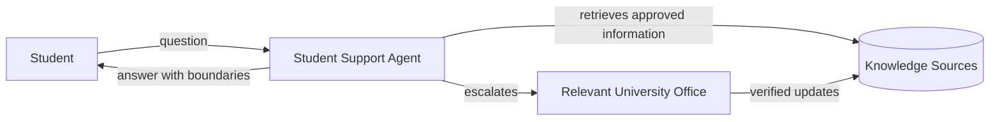

# Context Diagram

The application sits between students and approved institutional information. It supports discovery and explanation; it does not replace authorized university staff or make binding decisions.
