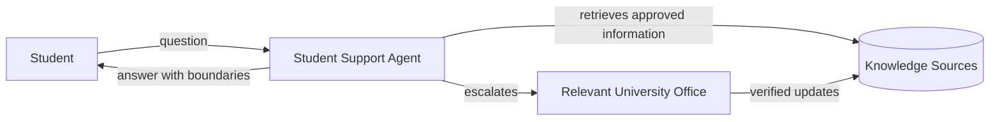

# Context Diagram

The expanded systems-design views are maintained in `01-system-context.md` through `08-end-to-end-activity.md`.

The application supports discovery and explanation; it does not replace authorized university staff or make binding decisions.
