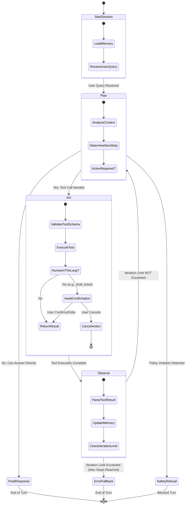

# Bounded Plan-Act-Observe Execution Graph

This document outlines the architecture for the Makerere Student Support Agent's core execution loop. It follows a "ReAct" (Reasoning and Acting) pattern, specifically bounded to prevent infinite loops and ensure safety.

## The Execution Graph

## Core Components & Boundaries

1.  **Plan (Reasoning):** The LLM analyzes the user's query and the session history. It determines if it has enough information to respond immediately or if it needs to fetch external data (Act).
2.  **Act (Execution):** If the LLM decides to use a tool (e.g., `get_student_status`), the system intercepts the request, validates it against the defined schemas (`src/schemas/tools.py`), and executes the underlying Python function. 
    *   *Boundary Check:* High-risk tools (like submitting a ticket) enter a "Human in the Loop" paused state.
3.  **Observe (Feedback):** The output of the tool is fed back into the session memory. 
    *   *Boundary Check:* A strict max-iteration counter is incremented. If the agent enters a loop (Plan -> Act -> Observe -> Plan...) that exceeds `MAX_ITERATIONS` (**5 steps**), execution is forcefully halted and falls back to an error state to prevent infinite token consumption.
4.  **Safety Layer (Non-Negotiable Refusals):** At the planning stage, queries are evaluated against safety policies. If a violation is detected (e.g., prompt injection, unauthorized access request), the graph immediately redirects to a `SafetyRefusal` state, bypassing all tool logic.

## Assignee Handoff
This graph design acts as the blueprint for **MM** to implement the `Agent Orchestrator & Loop Controller` and the `Max-Iteration Guard`.
