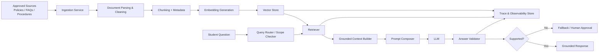

# RAG Architecture and Pipeline Specification

## Scope

This specification defines the Retrieval-Augmented Generation (RAG) layer for the Makerere Student Support Agent. The goal is to ground the model in approved policy documents and student-support guidance so that answers are traceable, evidence-based, and safe.

## System objective

The agent must answer student questions using approved knowledge rather than model memory alone. The architecture enforces a separation between:

- AI-generated answer drafting
- deterministic retrieval and validation checks
- human approval for sensitive or policy-critical workflows

## High-level pipeline

1. Approved source documents are discovered and loaded.
2. Documents are normalized and chunked.
3. Metadata is attached to each chunk.
4. Embeddings are generated and stored in a vector index.
5. A student question triggers retrieval of relevant chunks.
6. The retrieved evidence is inserted into the LLM prompt.
7. The model generates a grounded answer.
8. The answer is validated against the evidence and scope.
9. If support is insufficient, the system returns a bounded fallback or escalation.

## Diagram

## Offline ingestion flow

### 1. Source discovery

- Input: approved official policy pages, FAQs, procedures, and student-support guidance.
- Output: list of source documents and metadata.
- Interface: `KnowledgeIndex.ingest_directory(...)` and manifest-driven document registration.

### 2. Parsing and cleaning

- Convert PDFs/HTML/text into normalized plain text.
- Remove duplicated headers, boilerplate, broken tables, and irrelevant page artifacts.
- Keep source metadata such as title, source URL, version, and category.

### 3. Chunking

- Split documents into overlapping chunks of 400-700 tokens, with metadata preserved.
- Every chunk should retain document ID, title, category, section, source path, and chunk index.

### 4. Embedding and indexing

- Generate embeddings per chunk using an embedding model.
- Store vector representations, metadata, and source pointers in the vector index.
- Store the source document metadata in a separate registry for auditability.

## Online query flow

### 1. Query intake

- Input: student question and optional session context.
- Deterministic checks include scope, language constraints, and policy-classification checks.

### 2. Retrieval

- Query the vector index for the `top_k` most relevant chunks.
- Return relevance scores and source metadata.

### 3. Context injection

- Build a prompt containing:
  - student question
  - selected evidence chunks
  - clear instruction: answer only from approved evidence
- This is the grounding step, not a free-form model answer.

### 4. Generation and validation

- The LLM produces an answer based only on the provided context.
- The system checks whether the answer is supported by the retrieved documents.
- If the retrieved evidence is weak, conflicting, or absent, the system refuses to answer confidently.

## Deterministic vs AI responsibilities

### Deterministic controls

- question classification
- scope filtering
- document validation
- retrieval ranking and filtering
- evidence support checks
- response safety checks
- logging and traceability

### AI responsibilities

- answer synthesis from retrieved evidence
- summarization of relevant policy text
- drafting support tickets and guidance replies

### Human approval responsibilities

- sensitive student-status confirmation
- disciplinary, financial, or eligibility decisions
- final approval before ticket creation or communications outside the approved answer format

## Failure behavior

The system must handle the following explicitly:

- no relevant evidence found -> return a safe refusal or escalate
- conflicting documents -> flag ambiguity and require human review
- out-of-scope questions -> reject or redirect to supported resources
- vector index unavailable -> fail closed with explicit error
- unsupported answer -> mark as ungrounded and refuse delivery

## Evaluation and traceability requirements

Every answer should log:

- question ID
- session ID
- retrieved chunk IDs
- source documents
- relevance scores
- prompt template version
- context window used
- model name
- latency
- grounding verdict
- human review status

## Acceptance criteria

- a retriever returns relevant policy evidence for student questions
- the LLM is prompted with approved evidence only
- unsupported answers are rejected
- trace logs connect answer output to source documents
- all sensitive actions require human approval
- the design is implementable without guessing

## Implementation status

This repository currently contains the initial policy downloader and a baseline LLM harness. The next implementation stage adds the RAG indexing, retrieval, and grounded-response pipeline described here.
