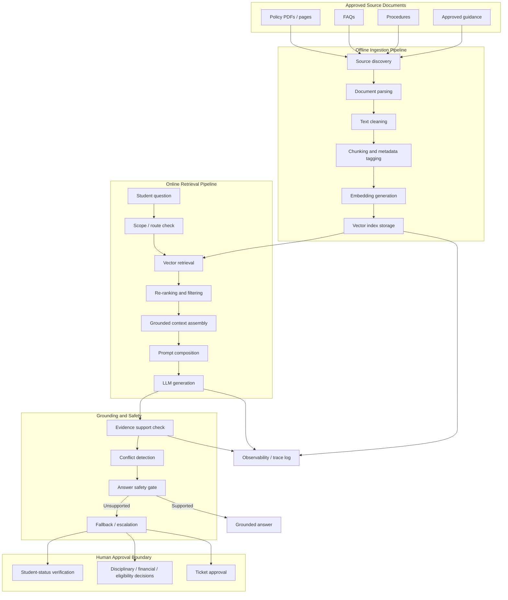

# RAG Architecture Diagram

## Interpretation

This diagram shows the essential RAG loop:

- approved documents are loaded offline,
- text is chunked and vectorized,
- a student question triggers retrieval of relevant chunks,
- the retrieved evidence is inserted into the prompt,
- the LLM answers only from that evidence,
- the answer is validated and escalated if unsupported.
